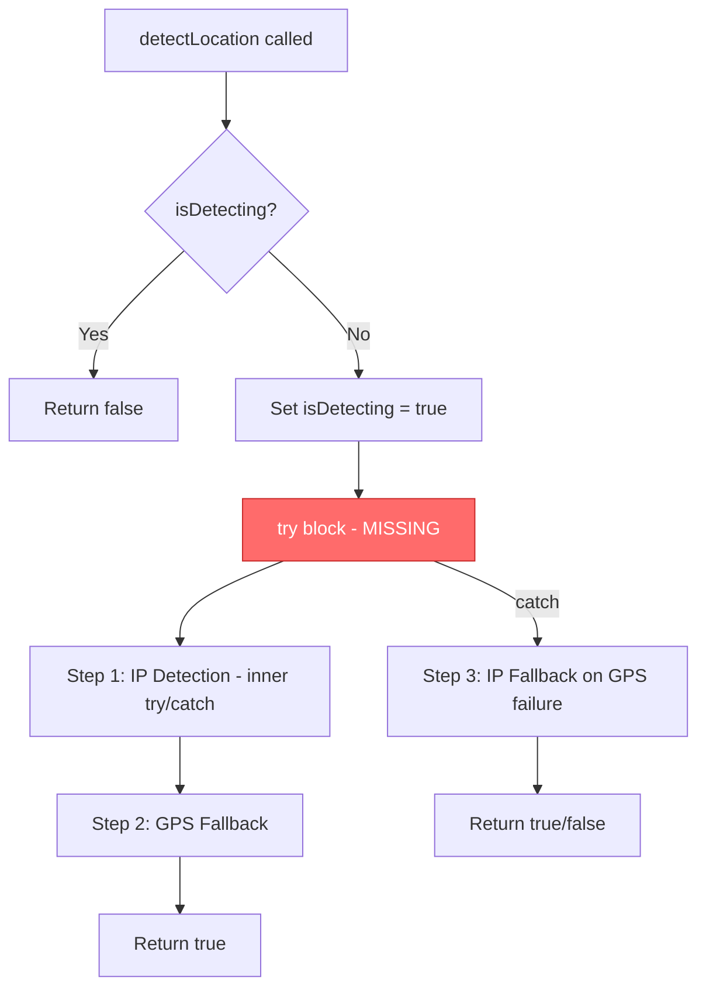
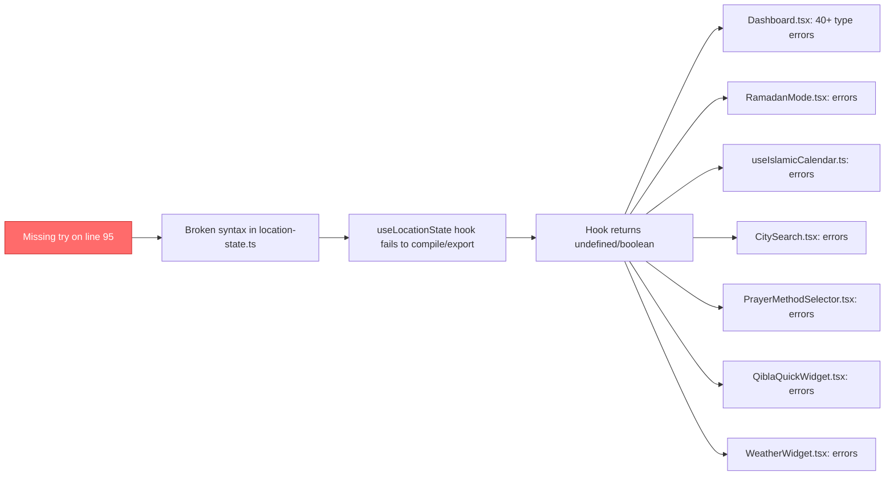

# Fix Plan: Cascading Location State Failure

## Root Cause Analysis

The **entire cascade of 40+ errors** across the project traces back to a **single missing `try {` statement** in [`location-state.ts`](src/lib/location-state.ts:95).

### The Bug in Detail

The [`detectLocation`](src/lib/location-state.ts:89) function inside `useCallback` has this intended control flow:



**Current broken code** (lines 94-169):
```typescript
// Line 94
setLocationState(prev => ({ ...prev, isDetecting: true }));

// Line 96 - MISSING: try {
// --- STEP 1: IP-BASED DETECTION ---
try {                          // Line 97 - inner try for IP
  // ... IP detection logic
} catch (ipError) {            // Line 119
  // ... IP failed, continue
}                              // Line 121

// --- STEP 2: SYSTEM GPS ---
// ... GPS detection logic
return true;                   // Line 168

} catch (error) {              // Line 169 - ORPHANED CATCH! No matching try
  // ... fallback logic
}
```

The outer `try {` that should wrap lines 97-168 is **missing** — leaving the `catch (error)` on line 169 orphaned. This single missing line breaks the entire file's syntax tree.

### Cascading Impact



**7 files** import from `useLocationState`:
- [`Dashboard.tsx`](src/pages/Dashboard.tsx:23) — most severely affected with 40+ property access errors
- [`RamadanMode.tsx`](src/pages/RamadanMode.tsx:11)
- [`useIslamicCalendar.ts`](src/hooks/useIslamicCalendar.ts:15)
- [`CitySearch.tsx`](src/components/CitySearch.tsx:9)
- [`PrayerMethodSelector.tsx`](src/components/PrayerMethodSelector.tsx:8)
- [`QiblaQuickWidget.tsx`](src/components/QiblaQuickWidget.tsx:6)
- [`WeatherWidget.tsx`](src/components/WeatherWidget.tsx:10)

## Fix Plan

### Step 1: Fix `location-state.ts` — Add the Missing `try {`

**File:** [`src/lib/location-state.ts`](src/lib/location-state.ts:95)

**Change:** Insert `try {` between line 94 and line 96.

**Before:**
```typescript
    setLocationState(prev => ({ ...prev, isDetecting: true }));

    // --- STEP 1: IP-BASED DETECTION (Private, No Google API) ---
```

**After:**
```typescript
    setLocationState(prev => ({ ...prev, isDetecting: true }));

    try {
    // --- STEP 1: IP-BASED DETECTION (Private, No Google API) ---
```

This single line addition restores the outer `try` block that matches the `catch (error)` on line 169, fixing:
- ✅ Syntax errors on lines 169 and 203
- ✅ `setLocationState` scope resolution on line 207
- ✅ "Declaration or statement expected" on line 221
- ✅ All 40+ Dashboard type errors (hook will export correctly)
- ✅ All errors in the other 6 consumer files

### Step 2: Verify the Fix

After the edit, run TypeScript compiler to confirm zero errors:
```bash
npx tsc --noEmit
```

### Step 3: Android Classpath Warnings — No Action Required

The warnings for [`BootReceiver.java`](android/app/src/main/java/com/noorconnect/app/BootReceiver.java), [`PrayerWidget.java`](android/app/src/main/java/com/noorconnect/app/PrayerWidget.java), and [`QuranVerseWidget.java`](android/app/src/main/java/com/noorconnect/app/QuranVerseWidget.java) are **IDE environment warnings**, not code bugs. They occur because:
- These are native Android Java files in a Capacitor hybrid project
- The IDE Java Language Server may not have the Android SDK classpath configured
- The app still compiles via Gradle which has the correct classpath

These can be ignored or resolved by configuring the IDE's Java classpath settings for the Android project.

## Summary

| Category | Files Affected | Action |
|----------|---------------|--------|
| Root Cause | `location-state.ts` | Add 1 line: `try {` after line 94 |
| Cascading Type Errors | 7 consumer files | Auto-resolved by fixing root cause |
| Android Warnings | 3 Java files | No action — IDE environment issue |
